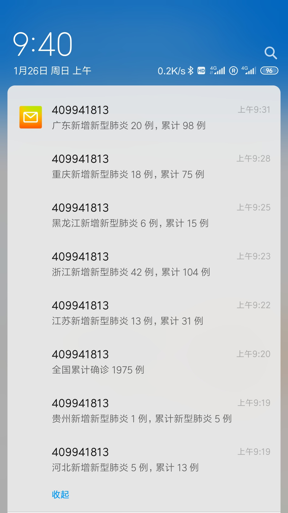
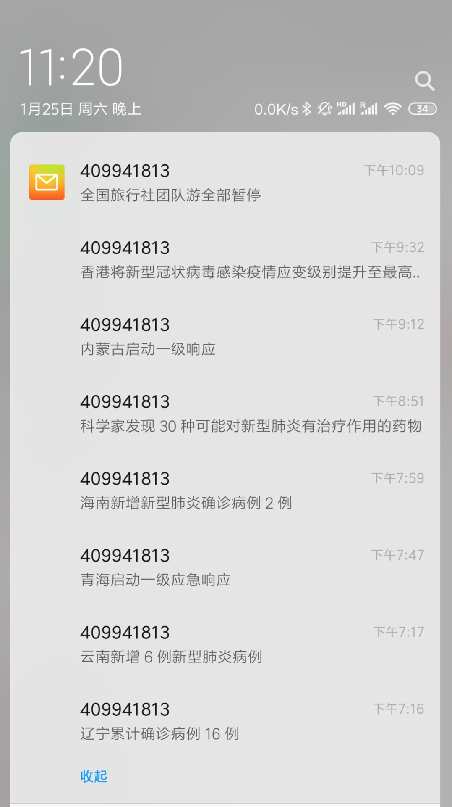

## 介绍
基于 [API项目](https://github.com/programmerauthor/spread-information) 的拓展应用

对技术细节不感兴趣的同学，可以直接拉到部署环节。

## 项目结构

```shell
├── README.md
├── app.js   # 应用主入口
├── assets
│   └── data  # 数据存储目录
├── config.js # 配置文件
├── info
│   └── info-core.js # 信息采集
├── package.json
├── sender
│   └── email-sender.js # 邮件发送
├── store
│   └── db-store.js  # 数据库API封装
├── templete
│   └── email-templete.js # 邮件模板
└── test.js
```

使用的相关技术构成:

* 网络请求 : axios
* 数据采集 : cheerio
* 数据导出 : nodejs vm
* 数据存储 : nedb
* 发送邮件 : nodemailer

## 核心讲解

### 主要流程

应用的处理流程非常简单:

① 获取最新的事件

② 对比数据库中记录的最后一个事件节点，

   找出节点之后的事件入库并发送邮件通知

### 关键代码

代码比较简单，也有比较详细的注释，直接贴了：
```javascript
async function refresh(){
    let infos = await info.getInfos();
    if(!infos || infos.length <=0){
        return;
    }
    //时间排序找到最后一个
    let docs = await db.findAndSort({
        sortQuery:{
            createTime:-1
        },
        limit:1
    });
    let newArr = [];
    if(docs && docs.length > 0){
        let doc = docs[0];
        for(let i = 0; i < infos.length; i++){
            let info = infos[i];
            //从新数据中对比逐个插入，直到发现已插入的数据为止. id 作为标记依据
            if(info.id > doc.id){
                //新数据
                newArr.push(info);
                //存入数据库
                await db.insert(info);
            }
        }
    }else{
        //取最新一条作为事件提醒
        newArr.push(infos[0]);
        //没有旧数据，全部存入
        await db.insert(infos);
    }
    if(newArr.length > 0){
        //发送邮件通知
        for(let i = 0; i < newArr.length; i++){
            let info = newArr[i];
            for(let j = 0; j < emails.length; j++){
                let email = emails[j];
                await sender.send({
                    to:email,
                    subject:info.title,
                    html:emailFactory.createEmailHtml({//模板可以自己修改
                        title:info.title,
                        content:info.summary,
                        baseUrl:baseUrl
                    })
                });
            }
        }
    }
}
```

## 如何配置

整个项目需要配置的内容都在根路径下的 config.js 中:

```javascript
const account = {
    from : `"sender-email" <sender-email@qq.com>`,  //改成你的邮箱
    host:'smtp.qq.com', //改成对应的邮箱服务商主机，QQ邮箱不用修改可以用这个
    port:'465', //改成对应邮箱服务商端接口，QQ邮箱不用修改可以用这个
    secureConnection:true, // 使用了 ssl
    auth:{
        user:'sender-email@qq.com',//用来发送邮件的邮箱，改成你的邮箱
        pass:'password'//邮箱的授权码，改成对应邮箱服务商的授权密码
    }
}

//接收者的邮箱数组
const emails = [
    'receive-email@qq.com'
]
```

注释写的很详细，就是配置个人的发送邮箱和收件人邮箱。

收件人配置项是个数组，可以配置多人邮箱，考虑到个人发送邮件还有数量限制，建议不要配置太多。如果有大量的需求，可以购买相关邮箱服务，关于这方面拓展，后面会讲一下。

关于发件人邮箱account的配置参数，每个邮件服务商提供的可能略有区别，到对应的邮箱服务商查看一下相关说明即可。

这里简单说一些QQ邮箱的配置，**登录QQ邮箱 -> 设置 -> 账户 -> IMAP/SMTP 服务 -> 开启**。

开启后会得到一个授权码，是当做密码来用的，这个授权码可以多次产生，配置到 `pass` 字段上当密码用即可。

## 如何部署

配置好邮箱以后，部署非常的简单。
```
1. git clone 项目到本地，并进入项目根路径
2. npm install -g pm2 # 安装pm2
3. pm2 start app.js --no-autorestart -c "*/2 * * * *" --name notify # 启动2分钟刷新一次
```

## 如何拓展

### 更换为购买的邮箱服务

将 `sender/email-sender.js` 中的函数实现改为对应邮箱服务的API实现即可。

### 邮件内容模板修改

对编写HTML我完全不会，邮件的模板只能是能读到信息流，需要更好看邮件样式的同学，可以修改 `templete/email-templte` 来实现。

为编写模板可提供的数据有:

```json
{
    "id": 951,
    "pubDate": 1580358836000,
    "pubDateStr": "55分钟前",
    "title": "北京小汤山医院启动修缮",
    "summary": "今天上午，北京市召开了新型冠状病毒感染的肺炎疫情防控工作新闻发布会。会后，北京市卫健委主任雷海潮介绍，目前小汤山医院已经启动修缮。当前，新型冠状病毒感染肺炎疫情防控形势严峻。各地版的“小汤山”医院都在紧锣密鼓的开工当中，北京小汤山康复医院此次修缮，是为了提供更好的就诊条件。这里将视疫情变化启用作为补充。",
    "infoSource": "人民日报",
    "sourceUrl": "http://m.weibo.cn/2803301701/4466411038836152",
    "provinceId": "11",
    "provinceName": "北京市",
    "createTime": 1580359817000,
    "modifyTime": 1580359817000
}
```
数据应该足够了，不够的话需要其他信息也可以提 issues。 

如果有人编写了好看模板，可以给我提一个 Pull requests ，感谢。

## 注意事项

有些同学邮件是可以正常到达的，但是收不到提醒。需要注意一下，应用可以送达邮件，但通知提醒是邮箱客户端来实现的，所以可能需要一个类似QQ邮箱客户端，网易邮箱大师之类的邮箱客户端来登录你的邮箱。

## 效果截图

|||
|--|--|
|||